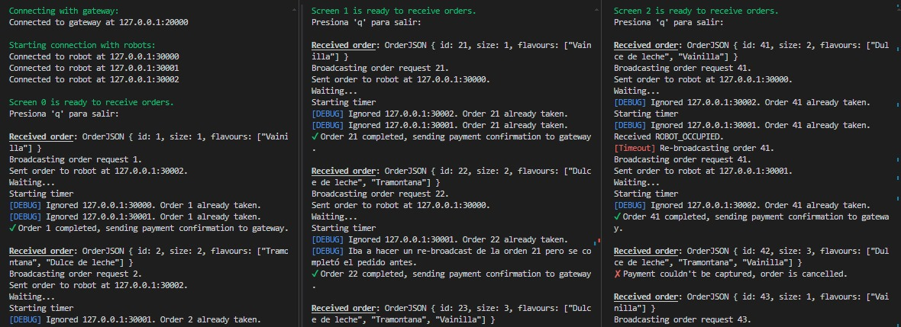
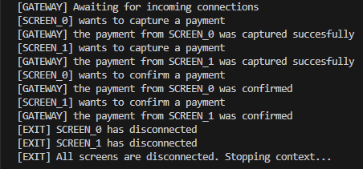
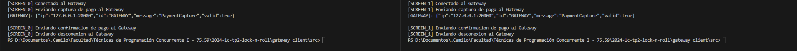

# Programación Concurrente (TB026) - Trabajo Práctico N◦2

## Grupo Lock n Roll - Integrantes:

| Alumno                                                      | Padrón |
| ----------------------------------------------------------- | ------ |
| [Alejo Fábregas](https://github.com/alejofabregas)          | 106160 |
| [Camilo Fábregas](https://github.com/camilofabregas)        | 103740 |
| [Juan Cruz Hernández](https://github.com/juanh2607)         | 105711 |

## Introducción

El objetivo del trabajo práctico es la construcción de una heladería donde los clientes pueden pedir helado mediante interfaces, que luego delegarán esos pedidos a robots que los prepararán de forma concurrente. Hay un gateway de pagos para realizar los cobros, que se van a loguear.

## Video

Link al video donde se mencionan algunos detalles de implementación relevantes y algunos ejemplos de ejecución del programa.

https://drive.google.com/drive/folders/1OGv3SMy5Vm7yuKnCYcW4If3D4XGbI-jj?usp=sharing

## Ejecución

Primero se deben iniciar el gateway y los robots.

### Gateway
```bash
cargo run
```

### Robots
```bash
cargo run <robot_id>
```

El id debe comenzar en 0 y se deben levantar como minimo 3 robots para completar el ring. Es importante que los ids sean secuenciales. 

Ej: en 3 terminales ejecutar `cargo run 0`, `cargo run 1` y `cargo run 2`.

### Screens
Una vez iniciado el gateway y los robots, se ejecutan las pantallas con el siguiente comando:
```bash
cargo run <screen_id> <orders.jsonl>
```

Para finalizar la ejecución, se ingresa `q` por terminal.

## Diseño

En nuestra solución vamos a utilizar **actores** para modelar a las distintas entidades. Estos actores van a correr en procesos separados, y se van a comunicar entre ellos mediante sockets. Vamos a tener distintos tipos de actores:
- **Pantalla**: son las interfaces en las que los clientes van a realizar los pedidos.
- **Robot**: van a recibir los pedidos de las Pantallas y los van a preparar con los Contenedores de gustos.
- **Gateway de pagos**: reciben la información de la tarjeta para capturar un pago.


Al iniciar el sistema, vamos a correr varias instancias de Pantallas y Robots, y una única instancia del Gateway de pagos.

\
Vamos a simular los pedidos de los clientes en cada Pantalla con un archivo **pedidos_<id>.json**. Cada Pantalla va a tener su propio archivo de pedidos, simulando la fila de gente que va a pedir en esa interfaz. Cada archivo va a contener información sobre los pedidos que va a realizar cada cliente. Al momento de iniciar cada Pantalla, se va a levantar el archivo y se va a ir leyendo de a un pedido para procesarlo.

Cuando una Pantalla procese un pedido, primero tiene que capturar el pago (sin hacer el cobro efectivo). Para eso, la Pantalla le enviará un mensaje al actor Gateway de pagos, que le va a responder con otro mensaje indicando si se pudo capturar el pago o si la tarjeta fue rechazada. Si tuvo éxito, la Pantalla seguirá adelante con el pedido. En caso negativo, se descartará ese pedido y se seguirá con el siguiente cliente.

\


\
Para seguir adelante con el pedido, la Pantalla va a enviar una solicitud a los Robots disponibles para que alguno tome el pedido. Esto se va hacer enviando mensajes a los Robots en forma de Broadcast. Aquellos Robots que estén disponibles para tomar el pedido responderán positivamente a la Pantalla. Luego, como el actor de la Pantalla tiene una FIFO, se va a elegir al primer mensaje de un Robot que le llegue para que se encargue de ese pedido. Se le va a enviar un mensaje sólo a ese Robot con la información del pedido para que lo prepare. En el caso de que estén todos los Robots ocupados, cuando uno se desocupe va a leer de su FIFO el pedido y le responderá a la Pantalla. Por el lado de la Pantalla, quedará bloqueada hasta que un Robot se desocupe y pueda tomarle el pedido.

Para soportar la caída de un Robot mientras está preparando el pedido, vamos a tener timeouts en la Pantalla. Cuando ésta confirme un pedido y se lo pida al Robot, iniciará un timer. Si ese timer se agota antes de que el Robot devuelva el pedido listo, la Pantalla interpreta que ese Robot se cayó, y que se perdió el pedido. Lo que va a hacer es volver a realizar el broadcast para iniciar el pedido nuevamente.

\


\
Una vez que un Robot recibe un pedido, tiene que ir a buscar los distintos gustos a los contenedores de helado. Para modelar esto decidimos usar **Exclusión Mutua Distribuida** con el Algoritmo de **Token Ring** para el acceso de los contenedores. La idea es tener tantos tokens como contenedores haya. El anillo por el que circularían estos tokens está integrado por todos los Robots. Para que un Robot pueda servir un gusto de helado de su pedido, tendrá que esperar a que le llegue el token correspondiente a ese gusto. Sólo aquel Robot que tenga el token puede acceder a ese gusto. Si un Robot necesita varios gustos para completar el pedido, va a tener que esperar por cada uno de los tokens de esos gustos, pero sólo puede agarrar de a uno. De esta manera, cada Robot puede servir de un contenedor a la vez, y un contenedor sólo puede ser usado por un Robot al mismo tiempo.

\


\
Finalmente, una vez que el Robot haya servido todos los gustos del pedido en el pote, se enviará un mensaje a la Pantalla que hizo el pedido para notificarle que ya está listo. Una vez que la Pantalla recibe el pedido, le envía un mensaje de confirmación al Robot para avisarle que se recibió con éxito. Esto es para el caso de que una Pantalla se caiga mientras un Robot le está preparando un pedido. En ese caso, el Robot no recibiría la confirmación de recepción, por lo que enviaría el pedido a alguna de las otras pantallas para que procese el pago posteriormente.

Una vez recibido y confirmado el pedido, la Pantalla enviará un mensaje al Gateway de Pagos para que se haga el cobro efectivo de ese pedido. Esto es si el Robot pudo preparar el pedido con éxito. Sin embargo, un pedido puede fallar porque no hay algún gusto de helado. En ese caso, se enviará un mensaje a la Pantalla que indique que no se pudo preparar el pedido, y la Pantalla no va a enviar un mensaje al Gateway de Pagos para loguear el cobro efectivo. Asumimos que los gustos que se usaron en un pedido fallido se desechan.

## Tipos de mensaje

Todos los mensajes van a tener los campos `ip` e `id` (para identificar al emisor), y el campo `message` (para identificar el tipo de mensaje).

**Captura del pago**
- `ip`: IP del emisor (Screen o Gateway)
- `id`: ID del emisor (Screen o Gateway)
- `message`: PaymentCapture
- `valid`: booleano (en defecto 'true', el Gateway lo puede devolver 'false' si falla la captura)

**Confirmación del pago**
- `ip`: IP de la Screen emisora
- `id`: ID de la Screen emisora
- `message`: PaymentConfirmation
- `order_data`: struct OrderPrep con la información del pedido (para loguear a disco)

**Pedido de Orden**
- `ip`: IP de la Screen emisora
- `id`: ID de la Screen emisora
- `message`: OrderRequest

**Preparación de Orden**
- `ip`: IP de la Screen emisora
- `id`: ID de la Screen emisora
- `message`: OrderPrep
- `size`: Tamaño del pote de helado del pedido
- `flavours`: Gustos del pedido
- `fail_flag`: 0 si la orden se preparó correctamente, 1 si no hay cantidad suficiente de helado o 2 si el Robot ya tiene una Order y no puede tomarla, que la Pantalla intente con otro Robot.

**Orden del JSON de la Screen**
- `message`: OrderJSON
- `size`: Tamaño del pote de helado del pedido
- `flavours`: Gustos del pedido

**Desconectar actores**
- `ip`: IP del actor emisor
- `id`: ID del actor emisor
- `message`: Disconnect

**Gusto de helado de Robots**
- `name`: Nombre del gusto
- `amount`: Cantidad disponible del gusto


## Ejemplo Ejecución
### Screens
<div style="text-align: center;">
    
</div>

\
En la imágen se puede ver la ejecución concurrente de 3 pantallas. El comportamiento es el siguiente:\
**1.** La pantalla se conecta con el gateway y los robots.

**2.** Si la conexión fue exitosa, se comienzan a procesar pedidos. Se puede ver que se imprime un "**Received Order**: `OrdenJSON`" con los datos correspondientes. 

**3.** Una vez recibido el pedido, se envía un `PaymentCapture` al gateway. Si se rechaza, la pantalla cancela la orden y continúa con la siguiente. Esto se puede ver en la pantalla 2 al procesar la orden 42 (abajo a la derecha).

**4.** Se hace un broadcast de un `OrderRequest` a todos los robots. También se comienza un **timer**, utilizado para detectar caidas de robots o pedidos que nunca fueron preparados porque el robot ganador en realidad se encontraba ocupado (el caso de la pantalla 2). Ante el caso en que se dispara el timer y no se completó la orden, se
asume que el robot dejo de funcionar y se vuelve a hacer un broadcast.

    En la pantalla 1 se puede ver en el cuarto print `[DEBUG]` que se dispara el timer, pero la pantalla detecta que la orden se encuentra completada, por lo que no hace el re-broadcast.

**5.** Se envía un `OrderPrep` al primer robot que contestó con un `OrderRequest` (el robot ganador). Con los prints `[DEBUG]` se puede ver que la pantalla ignora los `OrderRequest` de las pantallas siguientes. Por ejemplo, la pantalla 0 envió el pedido al robot 2 (puerto 30002).

**6.** En el caso feliz, se completa la orden, la pantalla recibe un `OrderPrep` con el flag `ORDER_SUCCESS`, se envía un `PaymentConfirmation` al gateway y se sigue procesando pedidos. Esto se puede ver para el caso de la pantalla 0. Hay dos casos no felices:

    a. Se recibe un `OrderPrep` pero con el flag `ROBOT_OCCUPIED`. Resulta que el robot que ganó, se encuentra ocupado con otro pedido, por lo que debemos hacer un re-broadcast.

    b. Se recibe un `OrderPrep` pero con el flag `ORDER_FAILED`. Esto significa que no hay helado suficiente para completar el pedido, por lo que se cancela la orden y se avanza con la siguiente. Ej:

<div style="text-align: center;">
    
</div>

\
Por último, se puede ver que tanto para la primer orden de la pantalla 1 como la primera de la pantalla 2, el robot 0 (puerto 30000) es el ganador del pedido. Sin embargo, como dijimos antes, el robot solo va a procesar uno de los pedidos y contestar con un `ROBOT_OCCUPIED` al otro. Este es el caso de la pantalla 2, que recibe el `ROBOT_OCCUPIED`. Acto siguiente, vemos que se dispara el `[Timeout]` y esta vez se hace un re-broadcast de la orden, la cuál es recibida por el robot 1 (puerto 30001) y se completa exitosamente, teniendo a los 3 robots procesando pedidos concurrentemente.


### Gateway
<div style="text-align: center;">
    
</div>

\
En la imagen se puede ver como es la lógica de mensajes vista desde el lado del Gateway:
1. Se inicia el servidor del Gateway y espera por la conexión de las pantallas.

2. Una vez se conectaron todas las pantallas, el Gateway empieza a recibir mensajes. En este caso, un mensaje `PaymentCapture` procediente de la **SCREEN_0**. El Gateway capturará el pago y contestará con el mismo mensaje.

3. El Gateway luego recibe otro `PaymentCapture`, pero ahora desde la **SCREEN_1**.

4. Al completar la orden, la pantalla **SCREEN_0** envió un mensaje `PaymentConfirmation` al Gateway. Esta orden será logueada a disco, junto al ID de la pantalla y el timestamp actual.

5. Lo mismo sucede con la pantalla **SCREEN_1**.

6. Luego el Gateway recibe mensajes `Disconnect` de las pantallas **SCREEN_0** y **SCREEN_1**.

7. Al haberse desconectado todas las pantallas, el Gateway decide **frenar su contexto**.

<div style="text-align: center;">
    
</div>

\
En la segunda imagen se puede ver como es la lógica de mensajes vista desde el lado del cliente:
1. Al enviar el `PaymentCapture`, el Gateway responde con el mismo mensaje. Esto puede tener dos escenarios:
    
    a. Se recibe un `valid = true`, lo que significa que el pedido fue **capturado exitosamente**.

    b. Se recibe un `valid = false`, lo que significa que el pedido **no pudo ser capturado** y debe ser cancelado.


### Robots

<div style="text-align: center;">
    
</div>

En esta imagen podemos ver cómo se conectan los Robots entre ellos y reciben conexiones de Pantallas para preparar Orders.

1. Los Robots se conectan con el anterior y el siguiente.

2. Los Robots reciben conexiones de Pantallas.

3. El Robot con id 0 crea los sabores (Flavours) y los envía al siguiente Robot para hacerlos circular por el anillo.

4. El siguiente Robot los recibe, y como no tiene que utilizarlos porque no tiene una Order pendiente, los hace circular.

5. Los Robots reciben un pedido de orden OrderRequest, y como no tienen Order pendiente, lo aceptan y responden a la pantalla.

6. El Robot id 0 recibe un OrderPrep ya que fue elegido para preparar esa Order.

<div style="text-align: center;">
    
</div>

7. El Robot id 0 recibe el gusto que necesita para preparar la Order (Dulce de leche). Lo consume, termina la Order y envía el gusto al siguiente Robot.

8. Los otros Robots reciben el Dulce de leche consumido por el Robot id 0, por lo que tiene 8 de amount en lugar de 10.

\
Podemos ver cómo funcionan las reconexiones entre Robots en la siguiente imagen:

<div style="text-align: center;">
    
</div>

1. Vemos que el Robot id 1 se desconecta.

2. El Robot id 0 detecta que el Robot siguiente se cayó, por lo que intenta conectarse al siguiente vivo, el Robot id 2.

3. El Robot id 2 detecta que el Robot anterior se cayó, por lo que espera que un nuevo Robot anterior se le conecte.

4. Una vez hecha la reconexión entre los Robots id 0 e id 2, se cierra el anillo y se siguen enviando los gustos de antes.

\
[](https://classroom.github.com/a/PKo6zpFB)
